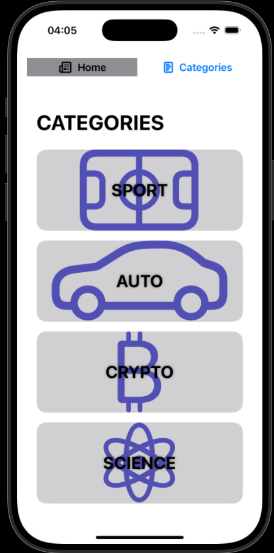

# Newsly_iOS
**Newsly_iOS** is a simple iOS application built with Swift and SwiftUI for browsing news articles. The app allows users to view detailed news, filter by categories, and search through articles.

---

## 🎯 Features
- 📰 Browse all news articles on the Home tab
- 🏷 Filter news by categories: Sports, Auto, Crypto, Science
- 🔍 Search news by title or content
- 📄 Detailed view of each news article
- 🏛 Simple and clean UI with SwiftUI

---

## 🛠 Technologies Used
- Swift
- SwiftUI
- MVVM pattern for clear separation of logic and UI
- NavigationStack / NavigationView for smooth navigation
- JSON files for sample data

---

## 📁 Project Structure
```
Newsly_iOS/
│
├── Models/            # Data models (News, NewsCategory)
├── ViewModels/        # Logic for loading and filtering news
├── Views/             # SwiftUI screens (Home, Categories, Detail)
├── Resources/         # Sample JSON files or images
└── Assets.xcassets/   # App icons, images, screenshots
```

---

## Screenshots📱





